# Profile Presets Feature — State Machines, Flows & User Journeys

This document captures the full architecture of the **Profile Presets** feature: state machines, sequence diagrams, flow charts, and user journeys.

---

## Table of Contents

1. [Profile Preset State Machine](#1-profile-preset-state-machine)
2. [Divergence Detection State Machine](#2-divergence-detection-state-machine)
3. [Preset Switch Coordinator State Machine](#3-preset-switch-coordinator-state-machine)
4. [CoreData Run Tracking State Machine](#4-coredata-run-tracking-state-machine)
5. [Sequence Diagram — Activate Preset](#5-sequence-diagram--activate-preset)
6. [Sequence Diagram — Divergence Detection](#6-sequence-diagram--divergence-detection)
7. [Sequence Diagram — Switch with Divergence Prompt](#7-sequence-diagram--switch-with-divergence-prompt)
8. [Sequence Diagram — Delete Preset](#8-sequence-diagram--delete-preset)
9. [Flow Diagram — Homescreen Chart & Info Panel](#9-flow-diagram--homescreen-chart--info-panel)
10. [Flow Diagram — Save Current Profile as Preset](#10-flow-diagram--save-current-profile-as-preset)
11. [User Journey — First-Time Setup](#11-user-journey--first-time-setup)
12. [User Journey — Day-to-Day Switching](#12-user-journey--day-to-day-switching)
13. [User Journey — Diverged Settings](#13-user-journey--diverged-settings)
14. [User Journey — Managing Presets](#14-user-journey--managing-presets)
15. [Data Flow Overview](#15-data-flow-overview)
16. [Component Map](#16-component-map)
17. [Gap Analysis — Missing States, Edge Cases & Unhandled Scenarios](#17-gap-analysis--missing-states-edge-cases--unhandled-scenarios)

---

## 1. Profile Preset State Machine

The lifecycle of a profile preset from creation to deletion.

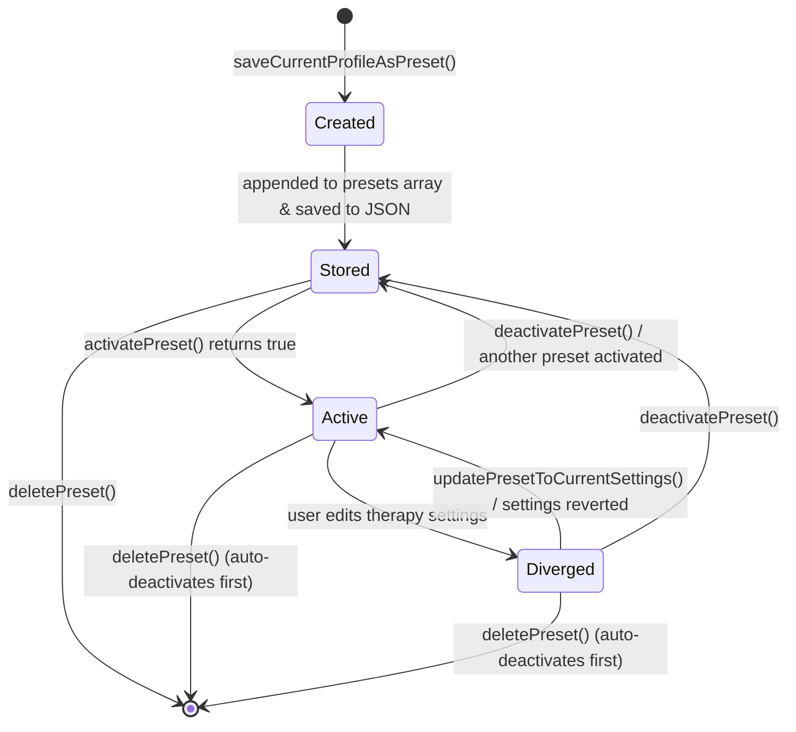
```mermaid
stateDiagram-v2
    [*] --> Created : saveCurrentProfileAsPreset()
    Created --> Stored : appended to presets array & saved to JSON

    Stored --> Active : activatePreset() returns true
    Active --> Stored : deactivatePreset() / another preset activated
    Active --> Diverged : user edits therapy settings
    Diverged --> Active : updatePresetToCurrentSettings() / settings reverted
    Diverged --> Stored : deactivatePreset()

    Stored --> [*] : deletePreset()
    Active --> [*] : deletePreset() (auto-deactivates first)
    Diverged --> [*] : deletePreset() (auto-deactivates first)
```

**Key states:**
| State | Description |
|-------|-------------|
| **Created** | A new preset is built from current therapy settings |
| **Stored** | Persisted in `profile_presets.json`, not currently active |
| **Active** | Its ID is written to `active_profile_preset_id.json`; settings match |
| **Diverged** | Active but current settings no longer match the preset's snapshot |

---

## 2. Divergence Detection State Machine

How `HomeStateModel` (and `AdjustmentsStateModel` / `ProfilePresetsStateModel`) track whether the active preset's settings still match.

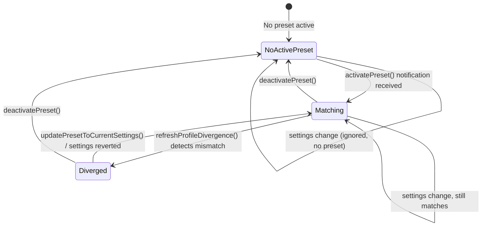
```mermaid
stateDiagram-v2
    [*] --> NoActivePreset : No preset active

    NoActivePreset --> Matching : activatePreset() notification received
    NoActivePreset --> NoActivePreset : settings change (ignored, no preset)

    Matching --> Diverged : refreshProfileDivergence() detects mismatch
    Matching --> Matching : settings change, still matches

    Diverged --> Matching : updatePresetToCurrentSettings() / settings reverted
    Diverged --> NoActivePreset : deactivatePreset()

    Matching --> NoActivePreset : deactivatePreset()
```

**Triggers for `refreshProfileDivergence()`:**
- `settingsDidChange` (TrioSettings)
- `preferencesDidChange` (Preferences — SMB/dynamic)
- `basalProfileDidChange`
- `bgTargetsDidChange`
- `insulinSensitivitiesDidChange`
- `carbRatiosDidChange`

**Comparison logic (`settingsMatchPreset`):**
- `preset.basalProfile == currentBasal`
- `preset.insulinSensitivities.sensitivities == currentISF.sensitivities`
- `preset.carbRatios.schedule == currentCR.schedule`
- `preset.bgTargets.targets == currentTargets.targets`
- `preset.smbSettings == currentSMB` (if included)
- `preset.dynamicSettings == currentDynamic` (if included)

---

## 3. Preset Switch Coordinator State Machine

The `PresetSwitchCoordinator` manages the divergence-save-prompt flow when a user requests switching from one preset to another.

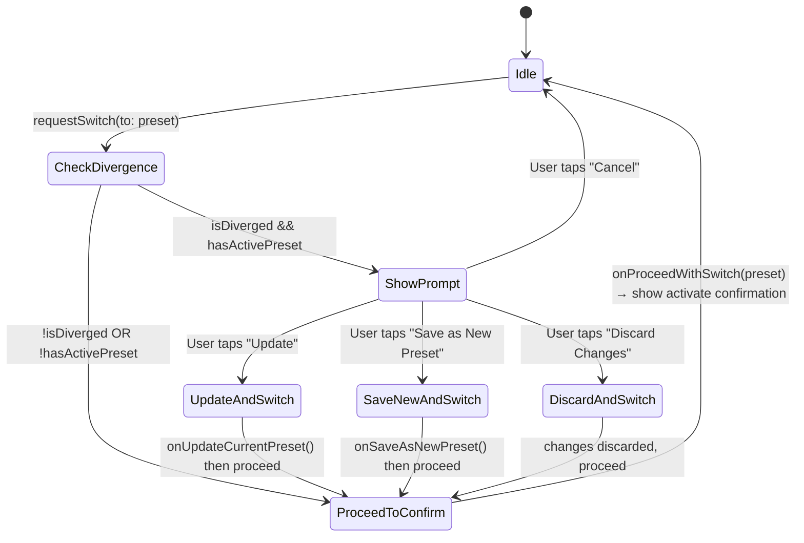
```mermaid
stateDiagram-v2
    [*] --> Idle

    Idle --> CheckDivergence : requestSwitch(to: preset)

    CheckDivergence --> ShowPrompt : isDiverged && hasActivePreset
    CheckDivergence --> ProceedToConfirm : !isDiverged OR !hasActivePreset

    ShowPrompt --> UpdateAndSwitch : User taps "Update"
    ShowPrompt --> SaveNewAndSwitch : User taps "Save as New Preset"
    ShowPrompt --> DiscardAndSwitch : User taps "Discard Changes"
    ShowPrompt --> Idle : User taps "Cancel"

    UpdateAndSwitch --> ProceedToConfirm : onUpdateCurrentPreset() then proceed
    SaveNewAndSwitch --> ProceedToConfirm : onSaveAsNewPreset() then proceed
    DiscardAndSwitch --> ProceedToConfirm : changes discarded, proceed

    ProceedToConfirm --> Idle : onProceedWithSwitch(preset) → show activate confirmation
```

**Prompt options (DivergenceSavePromptModifier):**
| Button | Action |
|--------|--------|
| **Update '\<name\>'** | `updatePresetToCurrentSettings()` then switch |
| **Save as New Preset** | Opens save-new-preset sheet, then switch |
| **Discard Changes** | Directly switch, losing diverged settings |
| **Cancel** | Return to idle, no switch |

---

## 4. CoreData Run Tracking State Machine

Each activation/divergence creates `ProfilePresetRunStored` entries in CoreData for chart display and Nightscout upload.

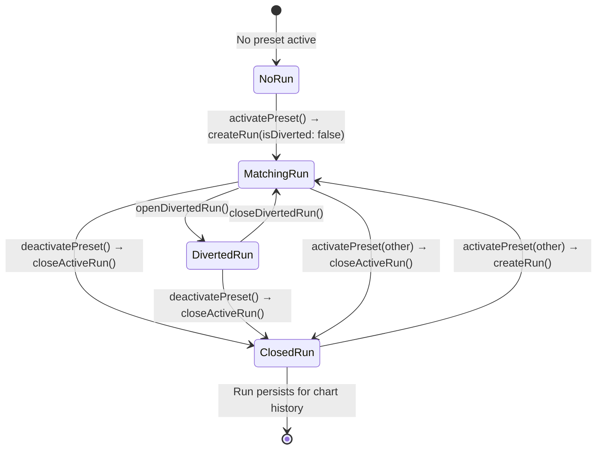
```mermaid
stateDiagram-v2
    [*] --> NoRun : No preset active

    NoRun --> MatchingRun : activatePreset() → createRun(isDiverted: false)

    MatchingRun --> DivertedRun : openDivertedRun()
    DivertedRun --> MatchingRun : closeDivertedRun()

    MatchingRun --> ClosedRun : deactivatePreset() → closeActiveRun()
    DivertedRun --> ClosedRun : deactivatePreset() → closeActiveRun()

    MatchingRun --> ClosedRun : activatePreset(other) → closeActiveRun()
    ClosedRun --> MatchingRun : activatePreset(other) → createRun()

    ClosedRun --> [*] : Run persists for chart history
```

**State transitions detail:**

| Transition | What happens in CoreData |
|-----------|-------------------------|
| `openDivertedRun()` | Close current run (set `endDate`), create new run with `isDiverted=true` |
| `closeDivertedRun()` | Close diverged run (set `endDate`), create new run with `isDiverted=false` |
| `closeActiveRun()` | Set `endDate` on run where `endDate == nil` |
| `createRun()` | Insert new `ProfilePresetRunStored` with `endDate=nil` |

**CoreData fields (`ProfilePresetRunStored`):**
| Field | Type | Description |
|-------|------|-------------|
| `id` | UUID | Unique run identifier |
| `presetId` | String | The preset this run belongs to |
| `name` | String | Preset name (denormalized for display) |
| `icon` | String | SF Symbol (denormalized) |
| `startDate` | Date | When the run started |
| `endDate` | Date? | `nil` while active, set on close |
| `isDiverted` | Bool | Whether settings diverged during this run |
| `isUploadedToNS` | Bool | Nightscout upload tracking |

---

## 5. Sequence Diagram — Activate Preset

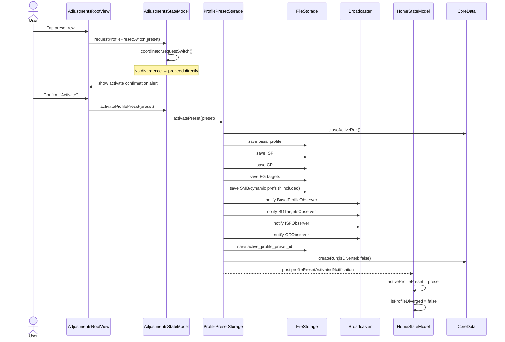
```mermaid
sequenceDiagram
    actor User
    participant AdjView as AdjustmentsRootView
    participant AdjState as AdjustmentsStateModel
    participant Storage as ProfilePresetStorage
    participant FileStore as FileStorage
    participant Broadcaster as Broadcaster
    participant HomeState as HomeStateModel
    participant CoreData as CoreData

    User->>AdjView: Tap preset row
    AdjView->>AdjState: requestProfilePresetSwitch(preset)
    AdjState->>AdjState: coordinator.requestSwitch()

    Note over AdjState: No divergence → proceed directly

    AdjState->>AdjView: show activate confirmation alert
    User->>AdjView: Confirm "Activate"
    AdjView->>AdjState: activateProfilePreset(preset)
    AdjState->>Storage: activatePreset(preset)

    Storage->>CoreData: closeActiveRun()
    Storage->>FileStore: save basal profile
    Storage->>FileStore: save ISF
    Storage->>FileStore: save CR
    Storage->>FileStore: save BG targets
    Storage->>FileStore: save SMB/dynamic prefs (if included)
    Storage->>Broadcaster: notify BasalProfileObserver
    Storage->>Broadcaster: notify BGTargetsObserver
    Storage->>Broadcaster: notify ISFObserver
    Storage->>Broadcaster: notify CRObserver
    Storage->>FileStore: save active_profile_preset_id
    Storage->>CoreData: createRun(isDiverted: false)
    Storage-->>HomeState: post profilePresetActivatedNotification

    HomeState->>HomeState: activeProfilePreset = preset
    HomeState->>HomeState: isProfileDiverged = false
```

---

## 6. Sequence Diagram — Divergence Detection

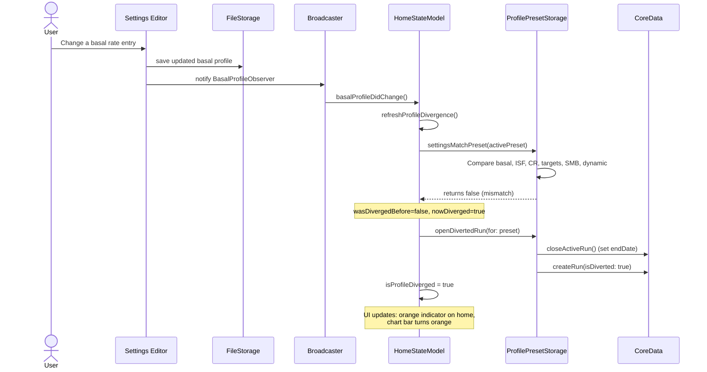
```mermaid
sequenceDiagram
    actor User
    participant Editor as Settings Editor
    participant FileStore as FileStorage
    participant Broadcaster as Broadcaster
    participant HomeState as HomeStateModel
    participant Storage as ProfilePresetStorage
    participant CoreData as CoreData

    User->>Editor: Change a basal rate entry
    Editor->>FileStore: save updated basal profile
    Editor->>Broadcaster: notify BasalProfileObserver

    Broadcaster->>HomeState: basalProfileDidChange()
    HomeState->>HomeState: refreshProfileDivergence()
    HomeState->>Storage: settingsMatchPreset(activePreset)

    Storage->>Storage: Compare basal, ISF, CR, targets, SMB, dynamic
    Storage-->>HomeState: returns false (mismatch)

    Note over HomeState: wasDivergedBefore=false, nowDiverged=true

    HomeState->>Storage: openDivertedRun(for: preset)
    Storage->>CoreData: closeActiveRun() (set endDate)
    Storage->>CoreData: createRun(isDiverted: true)

    HomeState->>HomeState: isProfileDiverged = true
    Note over HomeState: UI updates: orange indicator on home,<br/>chart bar turns orange
```

---

## 7. Sequence Diagram — Switch with Divergence Prompt

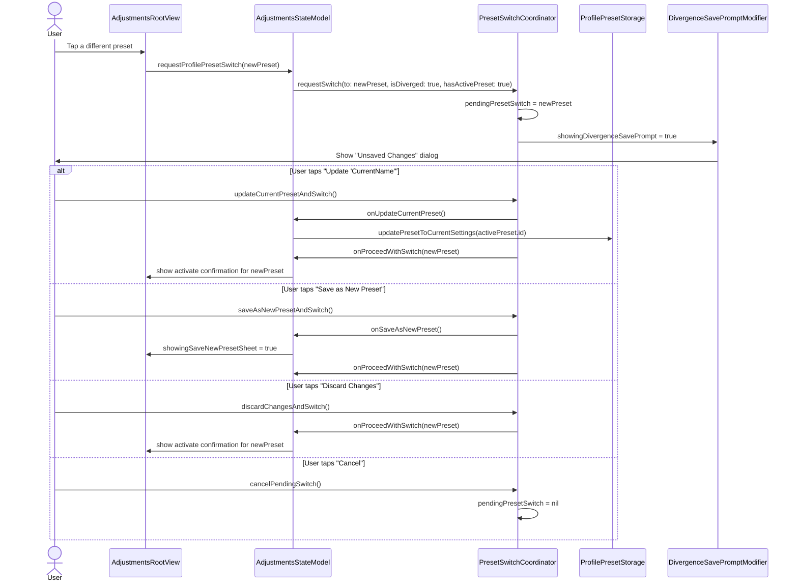
```mermaid
sequenceDiagram
    actor User
    participant View as AdjustmentsRootView
    participant State as AdjustmentsStateModel
    participant Coord as PresetSwitchCoordinator
    participant Storage as ProfilePresetStorage
    participant Prompt as DivergenceSavePromptModifier

    User->>View: Tap a different preset
    View->>State: requestProfilePresetSwitch(newPreset)
    State->>Coord: requestSwitch(to: newPreset, isDiverged: true, hasActivePreset: true)
    Coord->>Coord: pendingPresetSwitch = newPreset
    Coord->>Prompt: showingDivergenceSavePrompt = true
    Prompt->>User: Show "Unsaved Changes" dialog

    alt User taps "Update 'CurrentName'"
        User->>Coord: updateCurrentPresetAndSwitch()
        Coord->>State: onUpdateCurrentPreset()
        State->>Storage: updatePresetToCurrentSettings(activePreset.id)
        Coord->>State: onProceedWithSwitch(newPreset)
        State->>View: show activate confirmation for newPreset
    else User taps "Save as New Preset"
        User->>Coord: saveAsNewPresetAndSwitch()
        Coord->>State: onSaveAsNewPreset()
        State->>View: showingSaveNewPresetSheet = true
        Coord->>State: onProceedWithSwitch(newPreset)
    else User taps "Discard Changes"
        User->>Coord: discardChangesAndSwitch()
        Coord->>State: onProceedWithSwitch(newPreset)
        State->>View: show activate confirmation for newPreset
    else User taps "Cancel"
        User->>Coord: cancelPendingSwitch()
        Coord->>Coord: pendingPresetSwitch = nil
    end
```

---

## 8. Sequence Diagram — Delete Preset

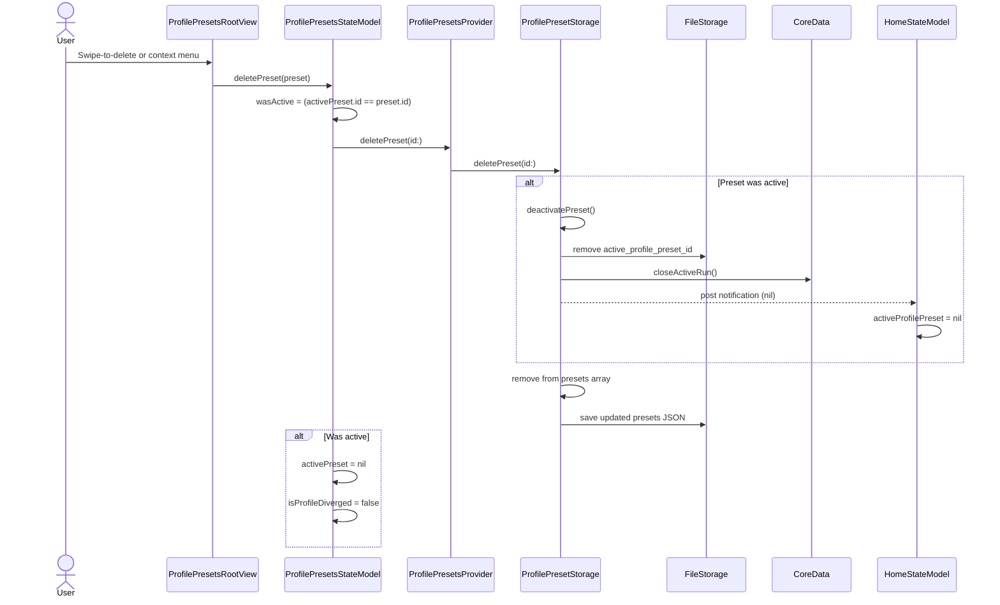
```mermaid
sequenceDiagram
    actor User
    participant View as ProfilePresetsRootView
    participant State as ProfilePresetsStateModel
    participant Provider as ProfilePresetsProvider
    participant Storage as ProfilePresetStorage
    participant FileStore as FileStorage
    participant CoreData as CoreData
    participant HomeState as HomeStateModel

    User->>View: Swipe-to-delete or context menu
    View->>State: deletePreset(preset)
    State->>State: wasActive = (activePreset.id == preset.id)
    State->>Provider: deletePreset(id:)
    Provider->>Storage: deletePreset(id:)

    alt Preset was active
        Storage->>Storage: deactivatePreset()
        Storage->>FileStore: remove active_profile_preset_id
        Storage->>CoreData: closeActiveRun()
        Storage-->>HomeState: post notification (nil)
        HomeState->>HomeState: activeProfilePreset = nil
    end

    Storage->>Storage: remove from presets array
    Storage->>FileStore: save updated presets JSON

    alt Was active
        State->>State: activePreset = nil
        State->>State: isProfileDiverged = false
    end
```

---

## 9. Flow Diagram — Homescreen Chart & Info Panel

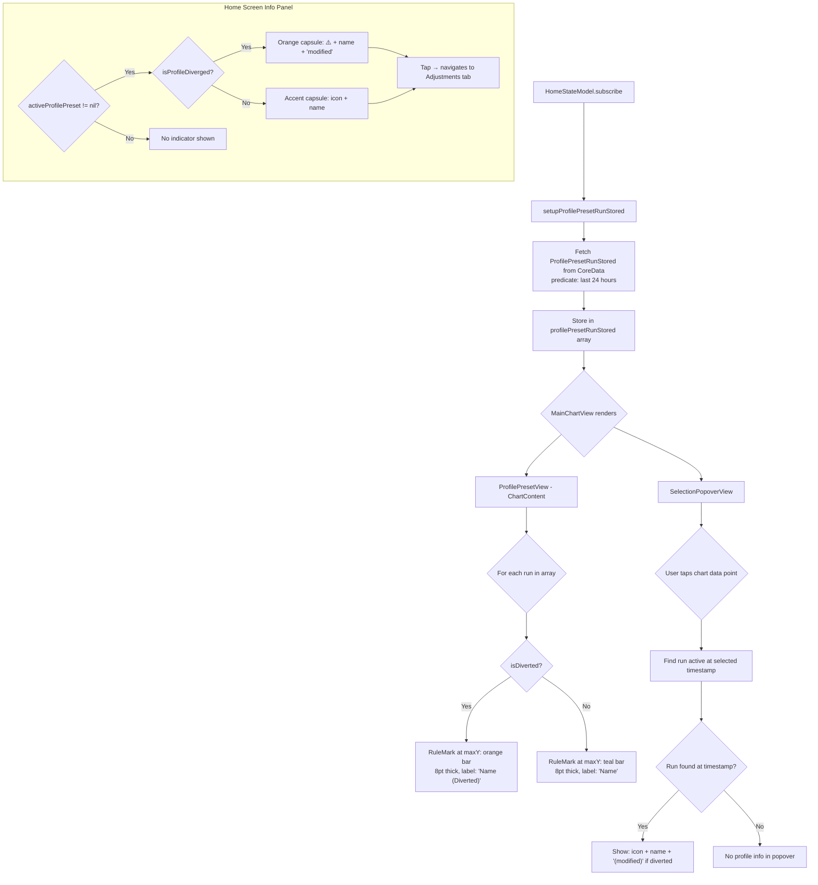
```mermaid
flowchart TD
    A[HomeStateModel.subscribe] --> B[setupProfilePresetRunStored]
    B --> C[Fetch ProfilePresetRunStored from CoreData<br/>predicate: last 24 hours]
    C --> D[Store in profilePresetRunStored array]

    D --> E{MainChartView renders}

    E --> F[ProfilePresetView - ChartContent]
    F --> G{For each run in array}
    G --> H{isDiverted?}
    H -->|Yes| I["RuleMark at maxY: orange bar<br/>8pt thick, label: 'Name (Diverted)'"]
    H -->|No| J["RuleMark at maxY: teal bar<br/>8pt thick, label: 'Name'"]

    E --> K[SelectionPopoverView]
    K --> L{User taps chart data point}
    L --> M[Find run active at selected timestamp]
    M --> N{Run found at timestamp?}
    N -->|Yes| O["Show: icon + name + '(modified)' if diverted"]
    N -->|No| P[No profile info in popover]

    subgraph "Home Screen Info Panel"
        Q{activeProfilePreset != nil?}
        Q -->|Yes| R{isProfileDiverged?}
        R -->|Yes| S["Orange capsule: ⚠️ + name + 'modified'"]
        R -->|No| T["Accent capsule: icon + name"]
        Q -->|No| U[No indicator shown]
        S --> V["Tap → navigates to Adjustments tab"]
        T --> V
    end
```

**Chart rendering details:**
- Uses `RuleMark` (thin horizontal line at `maxY`) instead of full-height `RectangleMark`
- 8pt line width positioned at chart top — subtle bar matching override/TT pattern
- Teal color for matching runs, orange for diverged runs
- Small `.system(size: 8)` text annotation overlaid on the bar

---

## 10. Flow Diagram — Save Current Profile as Preset

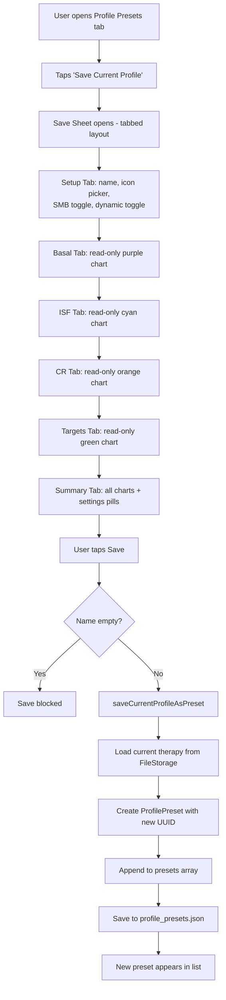
```mermaid
flowchart TD
    A[User opens Profile Presets tab] --> B["Taps 'Save Current Profile'"]
    B --> C[Save Sheet opens - tabbed layout]
    C --> D["Setup Tab: name, icon picker,<br/>SMB toggle, dynamic toggle"]
    D --> E[Basal Tab: read-only purple chart]
    E --> F[ISF Tab: read-only cyan chart]
    F --> G[CR Tab: read-only orange chart]
    G --> H[Targets Tab: read-only green chart]
    H --> I[Summary Tab: all charts + settings pills]
    I --> J[User taps Save]
    J --> K{Name empty?}
    K -->|Yes| L[Save blocked]
    K -->|No| M[saveCurrentProfileAsPreset]
    M --> N[Load current therapy from FileStorage]
    N --> O[Create ProfilePreset with new UUID]
    O --> P[Append to presets array]
    P --> Q[Save to profile_presets.json]
    Q --> R[New preset appears in list]
```

---

## 11. User Journey — First-Time Setup

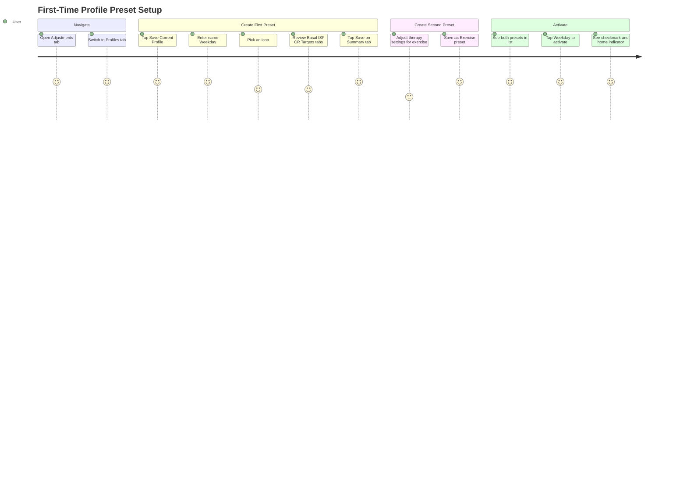
```mermaid
journey
    title First-Time Profile Preset Setup
    section Navigate
        Open Adjustments tab: 5: User
        Switch to Profiles tab: 5: User
    section Create First Preset
        Tap Save Current Profile: 5: User
        Enter name Weekday: 5: User
        Pick an icon: 4: User
        Review Basal ISF CR Targets tabs: 4: User
        Tap Save on Summary tab: 5: User
    section Create Second Preset
        Adjust therapy settings for exercise: 3: User
        Save as Exercise preset: 5: User
    section Activate
        See both presets in list: 5: User
        Tap Weekday to activate: 5: User
        See checkmark and home indicator: 5: User
```

---

## 12. User Journey — Day-to-Day Switching

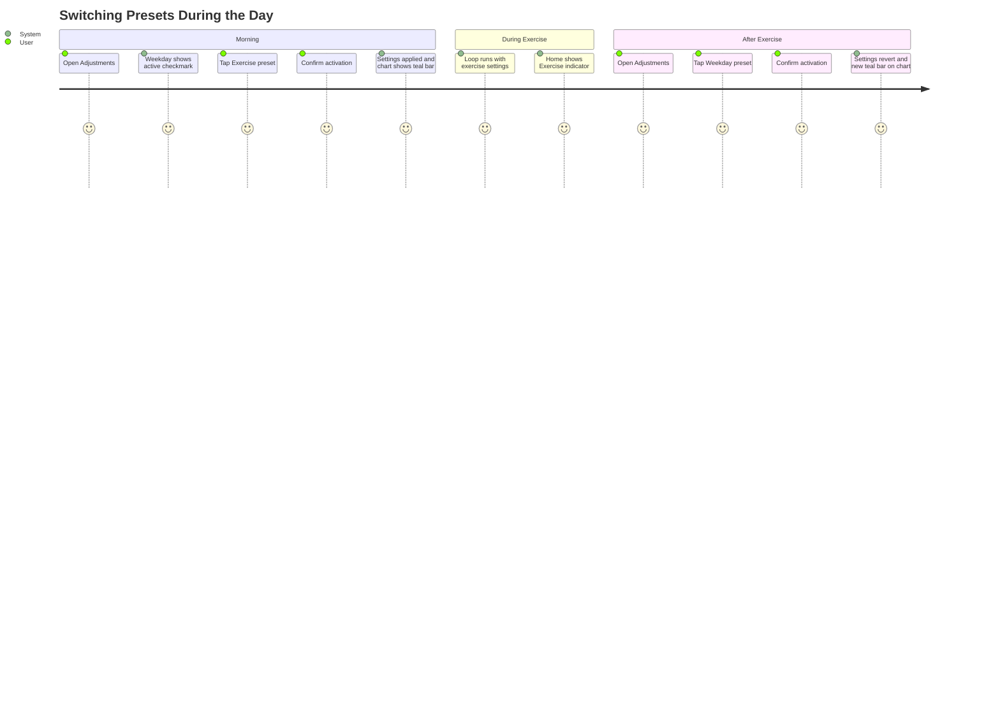
```mermaid
journey
    title Switching Presets During the Day
    section Morning
        Open Adjustments: 5: User
        Weekday shows active checkmark: 5: System
        Tap Exercise preset: 5: User
        Confirm activation: 5: User
        Settings applied and chart shows teal bar: 5: System
    section During Exercise
        Loop runs with exercise settings: 5: System
        Home shows Exercise indicator: 5: System
    section After Exercise
        Open Adjustments: 5: User
        Tap Weekday preset: 5: User
        Confirm activation: 5: User
        Settings revert and new teal bar on chart: 5: System
```

---

## 13. User Journey — Diverged Settings

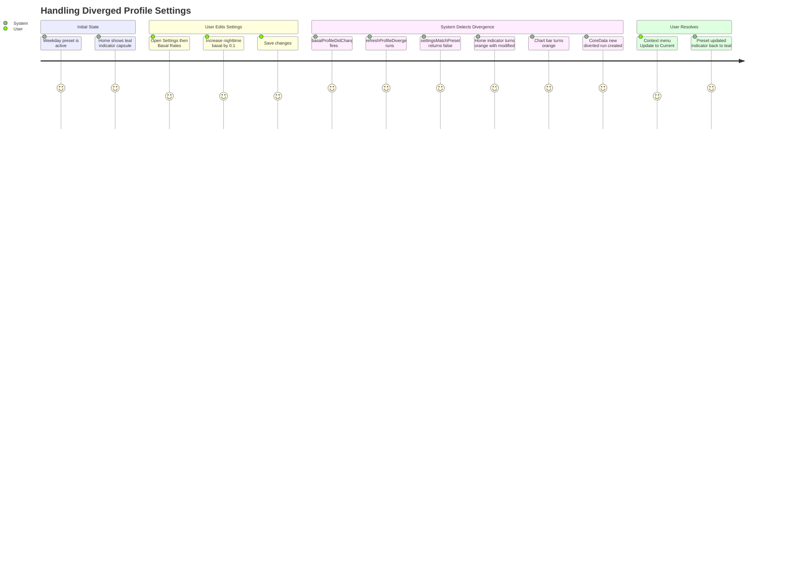
```mermaid
journey
    title Handling Diverged Profile Settings
    section Initial State
        Weekday preset is active: 5: System
        Home shows teal indicator capsule: 5: System
    section User Edits Settings
        Open Settings then Basal Rates: 4: User
        Increase nighttime basal by 0.1: 4: User
        Save changes: 4: User
    section System Detects Divergence
        basalProfileDidChange fires: 5: System
        refreshProfileDivergence runs: 5: System
        settingsMatchPreset returns false: 5: System
        Home indicator turns orange with modified: 5: System
        Chart bar turns orange: 5: System
        CoreData new diverted run created: 5: System
    section User Resolves
        Context menu Update to Current: 4: User
        Preset updated indicator back to teal: 5: System
```

---

## 14. User Journey — Managing Presets

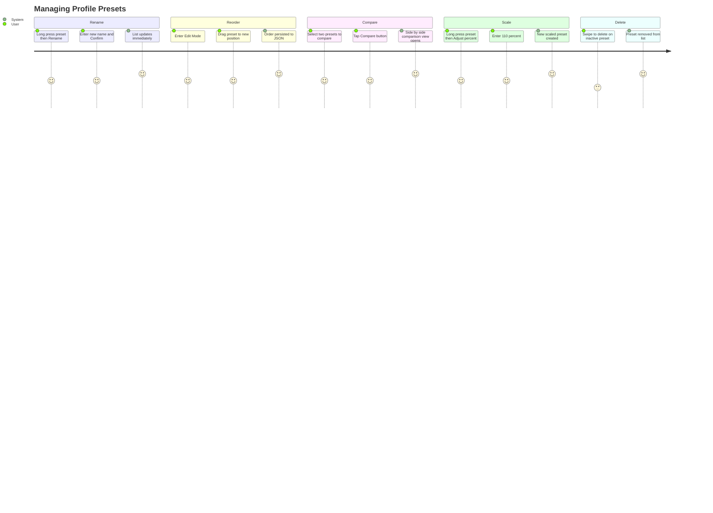
```mermaid
journey
    title Managing Profile Presets
    section Rename
        Long press preset then Rename: 4: User
        Enter new name and Confirm: 4: User
        List updates immediately: 5: System
    section Reorder
        Enter Edit Mode: 4: User
        Drag preset to new position: 4: User
        Order persisted to JSON: 5: System
    section Compare
        Select two presets to compare: 4: User
        Tap Compare button: 4: User
        Side by side comparison view opens: 5: System
    section Scale
        Long press preset then Adjust percent: 4: User
        Enter 110 percent: 4: User
        New scaled preset created: 5: System
    section Delete
        Swipe to delete on inactive preset: 3: User
        Preset removed from list: 5: System
```

---

## 15. Data Flow Overview

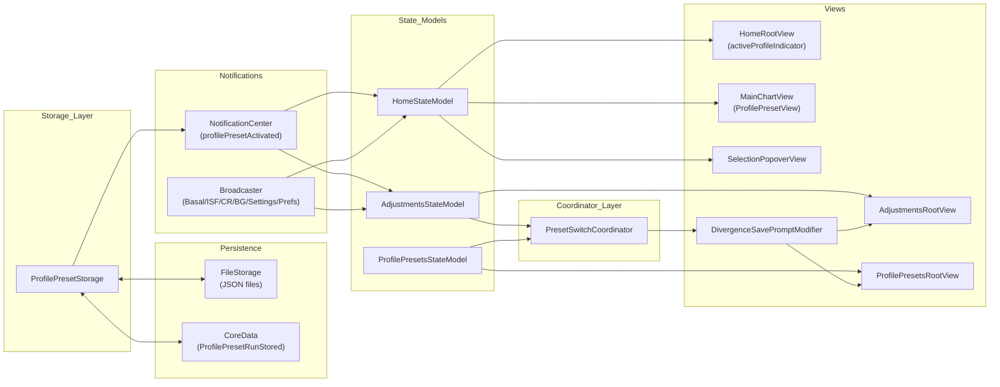
```mermaid
flowchart LR
    subgraph Persistence
        FS["FileStorage<br/>(JSON files)"]
        CD["CoreData<br/>(ProfilePresetRunStored)"]
    end

    subgraph Storage_Layer
        PPS[ProfilePresetStorage]
    end

    subgraph State_Models
        HSM[HomeStateModel]
        ASM[AdjustmentsStateModel]
        PSM[ProfilePresetsStateModel]
    end

    subgraph Coordinator_Layer
        PSC[PresetSwitchCoordinator]
    end

    subgraph Views
        HRV["HomeRootView<br/>(activeProfileIndicator)"]
        MCV["MainChartView<br/>(ProfilePresetView)"]
        SPV[SelectionPopoverView]
        ARV[AdjustmentsRootView]
        PRV[ProfilePresetsRootView]
        DSP[DivergenceSavePromptModifier]
    end

    subgraph Notifications
        BC["Broadcaster<br/>(Basal/ISF/CR/BG/Settings/Prefs)"]
        NC["NotificationCenter<br/>(profilePresetActivated)"]
    end

    PPS <--> FS
    PPS <--> CD
    PPS --> NC

    NC --> HSM
    NC --> ASM

    BC --> HSM
    BC --> ASM

    HSM --> HRV
    HSM --> MCV
    HSM --> SPV

    ASM --> ARV
    ASM --> PSC
    PSM --> PRV
    PSM --> PSC

    PSC --> DSP
    DSP --> ARV
    DSP --> PRV
```

---

## 16. Component Map

| Component | File(s) | Responsibility |
|-----------|---------|----------------|
| **ProfilePreset** | `Models/ProfilePreset.swift` | Data model: therapy snapshots + optional SMB/dynamic settings |
| **ProfilePresetStorage** | `APS/Storage/ProfilePresetStorage.swift` | CRUD, activate/deactivate, divergence check, CoreData run management, Nightscout export |
| **PresetSwitchCoordinator** | `Helpers/PresetSwitchCoordinator.swift` | State machine for divergence-save-prompt flow during switches |
| **DivergenceSavePromptModifier** | `Views/DivergenceSavePromptModifier.swift` | Reusable SwiftUI `confirmationDialog` for unsaved changes |
| **HomeStateModel** | `Modules/Home/HomeStateModel.swift` | Divergence detection via 6 observer protocols, manages UI state |
| **ProfilePresetSetup** | `Modules/Home/HomeStateModel+Setup/ProfilePresetSetup.swift` | Fetches CoreData runs (last 24h) for chart display |
| **ProfilePresetView** | `Modules/Home/View/Chart/ChartElements/ProfilePresetView.swift` | Subtle `RuleMark` bar at chart top (teal/orange) |
| **SelectionPopoverView** | `Modules/Home/View/Chart/ChartElements/SelectionPopoverView.swift` | Shows preset info when user taps a chart data point |
| **activeProfileIndicator** | `Modules/Home/View/HomeRootView.swift` | Capsule badge on home screen with icon + name |
| **AdjustmentsStateModel** | `Modules/Adjustments/AdjustmentsStateModel.swift` | Profile section in Adjustments: activate, switch, reorder |
| **ProfilePresetsStateModel** | `Modules/ProfilePresets/ProfilePresetsStateModel.swift` | Settings-side: save, rename, compare, delete, percentage scaling |
| **PresetChartViews** | `Modules/ProfilePresets/View/PresetChartViews.swift` | Read-only charts (Basal/ISF/CR/Targets) for save sheet & detail |
| **ProfilePresetRunStored** | CoreData `.xcdatamodeld` | Persistent run entries for chart visualization & Nightscout upload |
| **NightscoutManager** | `Services/Network/Nightscout/NightscoutManager.swift` | Uploads closed run entries as Nightscout note treatments |

---

## Appendix: Observer Protocol Chain

```
User edits therapy setting
        │
        ▼
  Settings Editor saves to FileStorage
        │
        ▼
  Broadcaster.notify(<Observer>.self)
        │
        ├──▶ HomeStateModel.basalProfileDidChange()
        │         └──▶ refreshProfileDivergence()
        │                   ├──▶ settingsMatchPreset()
        │                   └──▶ openDivertedRun() / closeDivertedRun()
        │
        ├──▶ HomeStateModel.bgTargetsDidChange()
        │         └──▶ refreshProfileDivergence()
        │
        ├──▶ HomeStateModel.insulinSensitivitiesDidChange()
        │         └──▶ refreshProfileDivergence()
        │
        ├──▶ HomeStateModel.carbRatiosDidChange()
        │         └──▶ refreshProfileDivergence()
        │
        ├──▶ HomeStateModel.settingsDidChange()
        │         └──▶ refreshProfileDivergence()
        │
        └──▶ HomeStateModel.preferencesDidChange()
                  └──▶ refreshProfileDivergence()
```

---

## 17. Gap Analysis — Missing States, Edge Cases & Unhandled Scenarios

The diagrams above capture the **designed happy paths**. A thorough code review reveals the following gaps — states, transitions, and use cases that are either not diagrammed or potentially unhandled in the implementation.

---

### 17.1 App Restart / Cold Start with Active Preset

**What happens:** On cold start, `HomeStateModel.subscribe()` calls `activeProfilePreset = profilePresetStorage.activePreset()` followed by `refreshProfileDivergence()`. If the user changed settings outside the app (e.g., via Nightscout, or the loop algorithm itself modified something), the preset may already be diverged at launch.

**Gap in diagrams:** No state machine or sequence diagram shows the cold-start path. The existing Divergence Detection state machine assumes a clean `[*] → NoActivePreset` entry, but on restart the system can land directly in `Matching` or `Diverged`.

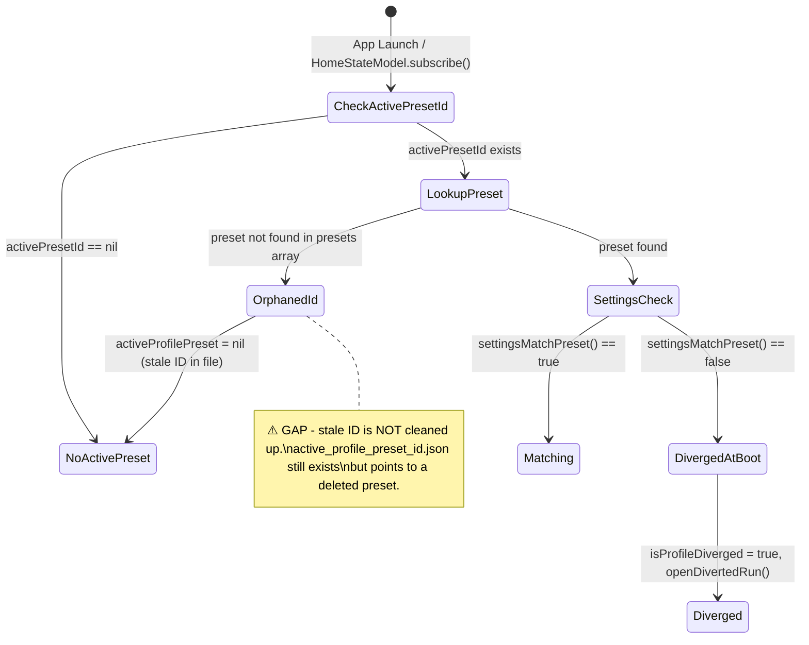
```mermaid
stateDiagram-v2
    [*] --> CheckActivePresetId : App Launch / HomeStateModel.subscribe()

    CheckActivePresetId --> NoActivePreset : activePresetId == nil
    CheckActivePresetId --> LookupPreset : activePresetId exists

    LookupPreset --> OrphanedId : preset not found in presets array
    LookupPreset --> SettingsCheck : preset found

    OrphanedId --> NoActivePreset : activeProfilePreset = nil (stale ID in file)

    SettingsCheck --> Matching : settingsMatchPreset() == true
    SettingsCheck --> DivergedAtBoot : settingsMatchPreset() == false

    DivergedAtBoot --> Diverged : isProfileDiverged = true, openDivertedRun()
    
    Note right of OrphanedId: ⚠️ GAP - stale ID is NOT cleaned up.\nactive_profile_preset_id.json still exists\nbut points to a deleted preset.
```

**Potential issue:** If a preset was deleted while the app was not running (e.g. settings file edited, iCloud sync), `activePresetId()` returns a stale ID, but `activePreset()` returns `nil`. The stale ID file is never cleaned up. `refreshProfileDivergence()` short-circuits because `activeProfilePreset` is nil, so no crash — but `active_profile_preset_id.json` remains with an orphaned ID.

---

### 17.2 Concurrent Activation Race Condition

**What happens:** Both `AdjustmentsStateModel` and `ProfilePresetsStateModel` independently call `activatePreset()`. If the user has both views in the navigation stack, rapid switching could theoretically call `activatePreset()` twice in quick succession.

**Gap:** The `activatePreset()` method is not synchronized. `closeActiveRun()` uses `viewContext.perform {}` (async on the main queue), while the rest of `activatePreset()` runs synchronously. A second call before the first `viewContext.perform` block executes could lead to **two open CoreData runs** — the first `closeActiveRun()` hasn't finished before the second call creates its run.

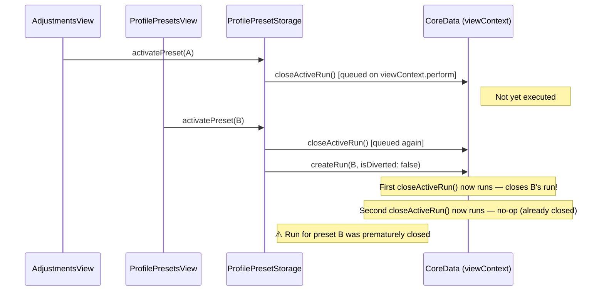
```mermaid
sequenceDiagram
    participant View1 as AdjustmentsView
    participant View2 as ProfilePresetsView
    participant Storage as ProfilePresetStorage
    participant CoreData as CoreData (viewContext)

    View1->>Storage: activatePreset(A)
    Storage->>CoreData: closeActiveRun() [queued on viewContext.perform]
    Note right of CoreData: Not yet executed

    View2->>Storage: activatePreset(B)
    Storage->>CoreData: closeActiveRun() [queued again]
    Storage->>CoreData: createRun(B, isDiverted: false)

    Note over CoreData: First closeActiveRun() now runs — closes B's run!
    Note over CoreData: Second closeActiveRun() now runs — no-op (already closed)

    Note right of Storage: ⚠️ Run for preset B was prematurely closed
```

---

### 17.3 "Save as New Preset" During Switch — Timing Gap

**What happens:** In the `PresetSwitchCoordinator`, when the user picks "Save as New Preset", the coordinator calls `onSaveAsNewPreset?()` (which opens the save sheet) and **immediately** calls `proceedWithPendingSwitch()` (which shows the activate confirmation). The user hasn't finished saving yet.

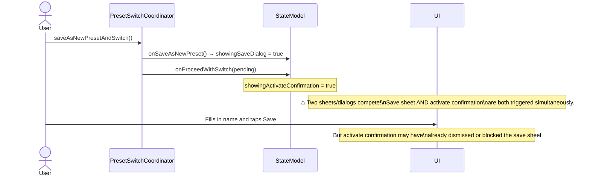
```mermaid
sequenceDiagram
    actor User
    participant Coord as PresetSwitchCoordinator
    participant State as StateModel
    participant View as UI

    User->>Coord: saveAsNewPresetAndSwitch()
    Coord->>State: onSaveAsNewPreset() → showingSaveDialog = true
    Coord->>State: onProceedWithSwitch(pending)
    Note over State: showingActivateConfirmation = true

    Note over View: ⚠️ Two sheets/dialogs compete!\nSave sheet AND activate confirmation\nare both triggered simultaneously.

    User->>View: Fills in name and taps Save
    Note over View: But activate confirmation may have\nalready dismissed or blocked the save sheet
```

**Gap:** The coordinator does not wait for the save sheet to complete. The "Save as New" + "Switch" are fire-and-forget — the new preset may not exist yet when the switch is confirmed.

---

### 17.4 Override + Profile Preset Interaction

**What happens:** Overrides (percentage-based basal/ISF/CR adjustments) are a separate system. An active override modifies the effective therapy settings. However, profile presets compare against the **stored** therapy files, not the override-adjusted values.

**Gap:** No diagram documents how overrides and profile presets coexist. While the code is correct (presets compare against base files, overrides layer on top), the user experience is undocumented:

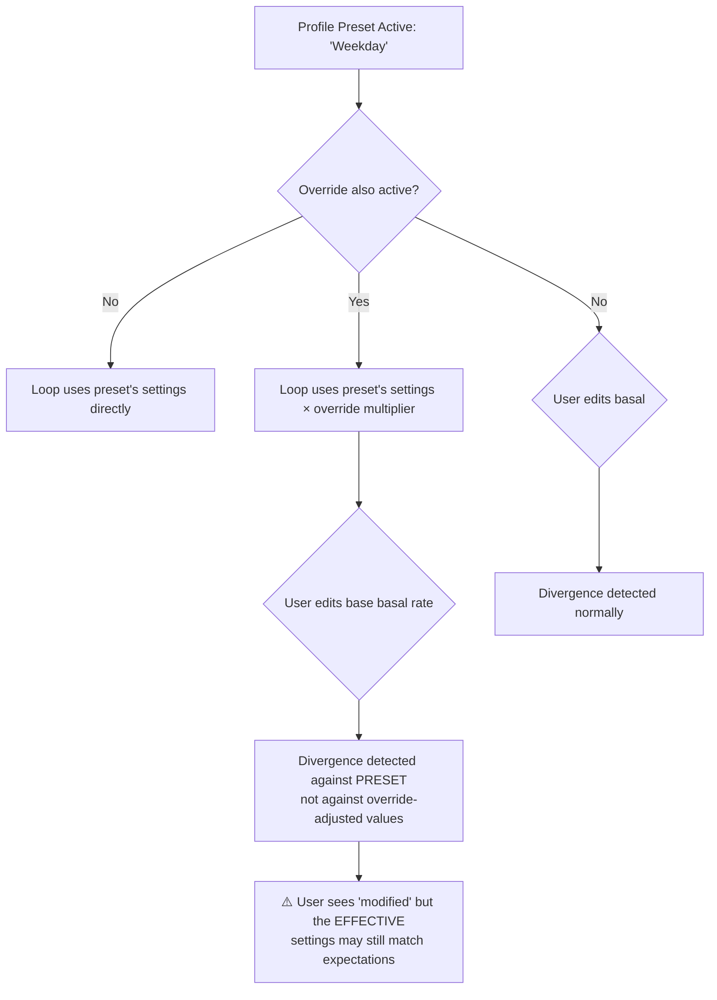
```mermaid
flowchart TD
    A[Profile Preset Active: 'Weekday'] --> B{Override also active?}
    B -->|No| C[Loop uses preset's settings directly]
    B -->|Yes| D[Loop uses preset's settings × override multiplier]
    
    D --> E{User edits base basal rate}
    E --> F[Divergence detected against PRESET\nnot against override-adjusted values]
    F --> G["⚠️ User sees 'modified' but the EFFECTIVE\nsettings may still match expectations"]
    
    B -->|No| H{User edits basal}
    H --> I[Divergence detected normally]
```

**Missing user journey:** A user activating an override while a profile preset is active sees no interaction in the UI. The profile indicator remains teal (matching) because overrides don't change the base files. However, if the user then navigates to Settings and sees the override-adjusted values, they might be confused about what "matches" means.

---

### 17.5 Nightscout Upload — Open Run Edge Case

**What happens:** `getProfilePresetRunsNotYetUploadedToNightscout()` fetches runs with `isUploadedToNS == false`. However, runs where `endDate == nil` (still open/active) are included in the predicate. The duration calculation uses `run.endDate?.timeIntervalSince(run.startDate ?? Date()) ?? 1`, which defaults to 1 second for open runs.

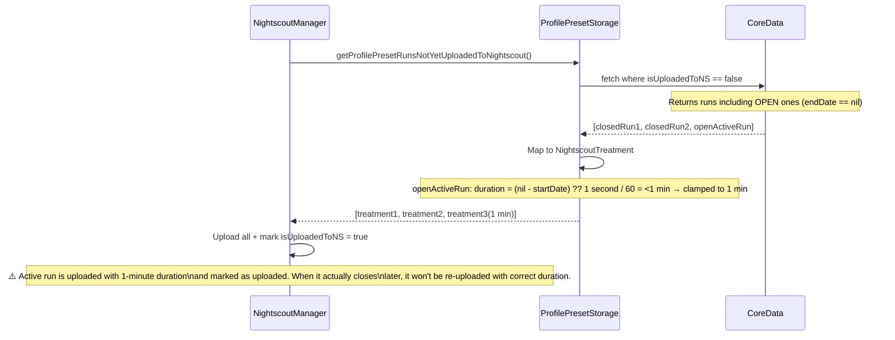
```mermaid
sequenceDiagram
    participant NS as NightscoutManager
    participant Storage as ProfilePresetStorage
    participant CoreData as CoreData

    NS->>Storage: getProfilePresetRunsNotYetUploadedToNightscout()
    Storage->>CoreData: fetch where isUploadedToNS == false

    Note over CoreData: Returns runs including OPEN ones (endDate == nil)

    CoreData-->>Storage: [closedRun1, closedRun2, openActiveRun]

    Storage->>Storage: Map to NightscoutTreatment
    Note over Storage: openActiveRun: duration = (nil - startDate) ?? 1 second / 60 = <1 min → clamped to 1 min

    Storage-->>NS: [treatment1, treatment2, treatment3(1 min)]
    NS->>NS: Upload all + mark isUploadedToNS = true

    Note over NS: ⚠️ Active run is uploaded with 1-minute duration\nand marked as uploaded. When it actually closes\nlater, it won't be re-uploaded with correct duration.
```

**Gap:** Open runs should be excluded from the upload query, or re-uploaded when they close. The current `NSPredicate.profilePresetRunsNotYetUploadedToNS` may not filter out `endDate == nil`.

---

### 17.6 Percentage Scaling — Validation Gaps

**What happens:** `ProfilePreset.scaled(by:name:)` creates a new preset with rates multiplied/divided by the percentage. The user enters any integer percentage.

**Missing states:**

| Scenario | What happens | Gap |
|----------|-------------|-----|
| Percentage = 0 | Basal → 0, ISF → div by 0, CR → div by 0 | 💥 **Division by zero crash** — no validation |
| Percentage = negative | Negative rates | ⚠️ No lower bound check |
| Percentage = 1000 | Extremely high basal rates | ⚠️ No upper bound / safety check |

```mermaid
flowchart TD
    A[User picks preset to scale] --> B["Enter percentage (Int)"]
    B --> C{Percentage validation?}
    C -->|"Current code: none"| D[scaled by: percentage]
    D --> E{"factor = Decimal(pct) / 100"}
    E --> F{factor == 0?}
    F -->|Yes| G["ISF / 0 = 💥 NaN / crash"]
    F -->|No| H{factor < 0?}
    H -->|Yes| I["Negative basal rates created"]
    H -->|No| J[Normal scaled preset created]
    
    style G fill:#ff6666
    style I fill:#ffaa66
```

---

### 17.7 Rename Active Preset — Notification Gap

**What happens:** `renamePreset()` updates the name in the JSON file. However, `HomeStateModel.activeProfilePreset` holds a **separate copy** of the preset object. No notification is posted when a preset is renamed.

```mermaid
sequenceDiagram
    actor User
    participant PSM as ProfilePresetsStateModel
    participant Storage as ProfilePresetStorage
    participant HomeState as HomeStateModel

    User->>PSM: beginRename("Weekday" → "Work Day")
    PSM->>Storage: renamePreset(id: "abc", newName: "Work Day")
    Storage->>Storage: Update in-memory array + save JSON

    PSM->>PSM: presets[index].name = "Work Day"
    PSM->>PSM: activePreset?.name = "Work Day" (local copy)

    Note over HomeState: ⚠️ activeProfilePreset.name is STILL "Weekday"\nHome screen indicator shows stale name\nuntil next activation or app restart
```

**Gap:** The Home indicator badge shows the stale name. `ProfilePresetsStateModel.confirmRename()` does update its own `activePreset` copy, but `HomeStateModel` is unaware of the rename. A `profilePresetActivatedNotification` is not posted on rename.

---

### 17.8 "Update Preset to Current Settings" — Run Tracking Gap

**What happens:** `updatePresetToCurrentSettings()` replaces the preset's therapy data with current settings and sets `isProfileDiverged = false`. However, it does **not** call `closeDivertedRun()`.

```mermaid
sequenceDiagram
    participant State as StateModel
    participant Storage as ProfilePresetStorage
    participant CoreData as CoreData

    State->>Storage: updatePresetToCurrentSettings(id)
    Storage->>Storage: Replace preset data with current settings
    Storage->>Storage: Save to JSON
    Storage-->>State: returns updated preset

    State->>State: isProfileDiverged = false

    Note over CoreData: ⚠️ The diverged run (isDiverted=true)\nis still OPEN in CoreData.\nNo closeDivertedRun() is called.\nChart continues showing orange bar.
```

**Gap:** The state model sets `isProfileDiverged = false`, which will prevent `refreshProfileDivergence()` from calling `closeDivertedRun()` on the next check (since `wasDivergedBeforeRefresh` will be `true` but `nowDiverged` will be `false` — this actually **does** trigger `closeDivertedRun()` on the next observer callback). However, there's a window between the update and the next observer fire where the CoreData run is still open and marked diverged.

---

### 17.9 Missing User Journeys

The following user journeys are not documented:

| Journey | Description | Why it matters |
|---------|-------------|----------------|
| **Import/Restore** | User restores a backup or syncs from iCloud. Preset files may contain presets from a different device configuration. | Active preset ID may reference a preset that doesn't exist in the restored data. |
| **Nightscout ↔ Profile** | User views preset runs in Nightscout. What does the uploaded data look like? How to interpret it? | Users need to understand the note format: `"Profile: Name"` vs `"Profile: Name (Diverted)"`. |
| **Delete All Presets** | User deletes all presets while one is active. | Deactivation fires for the active one, but the empty state of the Profiles tab is undocumented. |
| **Same Preset Re-activated** | User taps the already-active preset. | The coordinator proceeds through the full activate flow — closes and reopens the run, needlessly creating CoreData churn. |
| **App Backgrounded During Activation** | User switches to another app mid-activation flow. | `viewContext.perform` blocks may complete in the background; notification observers may fire after the view is gone. |

---

### 17.10 Summary of Identified Gaps

| # | Gap | Severity | Type | Status |
|---|-----|----------|------|--------|
| 17.1 | Stale `active_profile_preset_id.json` after preset deletion while app not running | Low | Edge case | Mitigated — `activePreset()` already returns `nil` when the ID references a deleted preset; `deletePreset()` auto-deactivates. Cold-start `closeStaleRuns()` handles orphaned CoreData runs. |
| 17.2 | Concurrent `activatePreset()` calls may create duplicate CoreData runs | Low | Race condition | Open |
| 17.3 | "Save as New" + switch fires both actions simultaneously without awaiting save completion | Medium | UX flow gap | Open |
| 17.4 | Override ↔ Profile Preset interaction is undocumented | Low | Documentation | Open |
| 17.5 | Open (active) runs may be uploaded to Nightscout with 1-min duration and never re-uploaded | Medium | Data correctness | ✅ Fixed — predicate now requires `endDate != nil` |
| 17.6 | `scaled(by:)` has no validation — 0% causes division by zero | High | Crash bug | ✅ Fixed — returns `nil` for percentage ≤ 0 |
| 17.7 | Rename doesn't notify HomeStateModel — stale name on home indicator | Low | UI consistency | ✅ Fixed — posts `profilePresetActivatedNotification` on rename |
| 17.8 | `updatePresetToCurrentSettings` doesn't immediately close the diverged run in CoreData | Low | Timing window | ✅ Fixed — now closes diverged run and opens matching run |
| 17.9 | Several user journeys undocumented (import, re-activate same, delete all, background) | Low | Documentation | Open |
| 17.10 | Same-preset re-activation creates unnecessary CoreData run churn | Low | Optimization | ✅ Fixed — `activatePreset()` returns early if same preset is active and settings match |

---

### 17.11 Cold-Start Recovery

When the app is force-quit or crashes, open CoreData runs (endDate == nil) are left behind. On the next cold-start, `HomeStateModel.subscribe()` now performs recovery:

```mermaid
flowchart TD
    A[App Cold Start] --> B["closeStaleRuns()"]
    B --> C[Fetch all runs where endDate == nil]
    C --> D{Any open runs?}
    D -->|No| E[Continue]
    D -->|Yes| F[Set endDate = now on all open runs]
    F --> G[Save CoreData context]
    G --> E

    E --> H["activePreset = profilePresetStorage.activePreset()"]
    H --> I{Preset found?}
    I -->|No| J[No indicator shown]
    I -->|Yes| K["settingsMatchPreset(preset)"]
    K --> L{Settings match?}
    L -->|Yes| M["Open non-diverged run\nwasDivergedBeforeRefresh = false"]
    L -->|No| N["Open diverged run\nwasDivergedBeforeRefresh = true\nisProfileDiverged = true"]
```

This ensures:
- No duplicate open runs accumulate across restarts
- The active preset indicator is always displayed correctly after restart
- The divergence state is accurately initialized (not starting from `false` and requiring a subsequent observer callback)

---

### 17.12 Activation Validation State Machine

`activatePreset()` now validates inputs before proceeding:

```mermaid
stateDiagram-v2
    [*] --> ValidatePreset : activatePreset(preset)

    ValidatePreset --> Rejected : basalProfile empty
    ValidatePreset --> Rejected : ISF sensitivities empty
    ValidatePreset --> Rejected : CR schedule empty
    ValidatePreset --> Rejected : BG targets empty
    ValidatePreset --> NoOp : preset.id == activePresetId() AND settings match
    ValidatePreset --> Accepted : all checks pass

    Rejected --> [*] : return false
    NoOp --> [*] : return true (skip re-activation)

    Accepted --> CloseExistingRun
    CloseExistingRun --> WriteSettings
    WriteSettings --> BroadcastChanges
    BroadcastChanges --> SaveActiveId
    SaveActiveId --> CreateNewRun
    CreateNewRun --> PostNotification
    PostNotification --> [*] : return true

    Note right of NoOp: ✅ Same-preset guard prevents\nunnecessary CoreData churn
```
